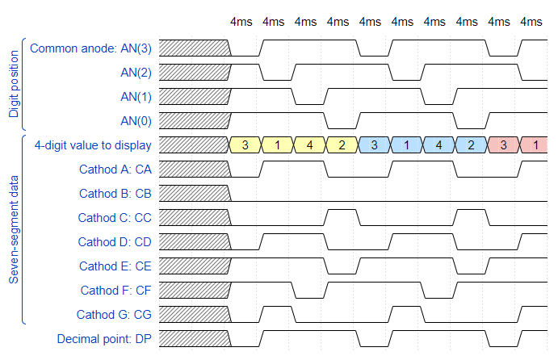

## Digital-electronics-1

https://github.com/Fabulec/Digital-electronics-1

# Lab 6: Driver for multiple seven-segment displays

# 1.Preparation task:
## Timing diagram figure for displaying value 3.142:



## Code from  WaveDrom:
 ```vhdl
{
  signal:
  [
    ['Digit position',
      {name: 'Common anode: AN(3)', wave: 'xx01..01..01'},
      {name: 'AN(2)', wave: 'xx101..01..0'},
      {name: 'AN(1)', wave: 'xx1.01..01..'},
      {name: 'AN(0)', wave: 'xx1..01..01.'},
    ],
    ['Seven-segment data',
      {name: '4-digit value to display', wave: 'xx3333555599', data: ['3','1','4','2','3','1','4','2','3','1']},
      {name: 'Cathod A: CA', wave: 'xx01.0.1.0.1'},
      {name: 'Cathod B: CB', wave: 'xx0.........'},
      {name: 'Cathod C: CC', wave: 'xx0..10..10.'},
      {name: 'Cathod D: CD', wave: 'xx01.0.1.0.1'},
      {name: 'Cathod E: CE', wave: 'xx1..01..01.'},
      {name: 'Cathod F: CF', wave: 'xx1.01..01..'},
      {name: 'Cathod G: CG', wave: 'xx010..10..1'},
    ],
    {name: 'Decimal point: DP', wave: 'xx01..01..01'},
  ],
  head:
  {
    text: '                    4ms   4ms   4ms   4ms   4ms   4ms   4ms   4ms   4ms   4ms',
  },
}
```

# 2.Display driver:
## Listing of VHDL code of the process p_mux:

```vhdl

```

## Listing of VHDL testbench file tb_driver_7seg_4digits:

```vhdl
entity hex_7seg is
    Port ( hex_i : in STD_LOGIC_VECTOR (4 - 1 downto 0);  --Input binary data
           seg_o : out STD_LOGIC_VECTOR (7 - 1 downto 0));   --Cathode values in the order A, B, C, D, E, F, G
end hex_7seg;

architecture Behavioral of hex_7seg is
begin
p_7seg_decoder : process(hex_i)
begin
 case hex_i is --Klasický case
            when "0000" =>
                seg_o <= "0000001";     -- 0
            when "0001" =>
                seg_o <= "1001111";     -- 1
            when "0010" =>
                seg_o <= "0010010";     -- 2
            when "0011" =>
                seg_o <= "0000110";     -- 3
            when "0100" =>
                seg_o <= "1001100";     -- 4
            when "0101" =>
                seg_o <= "0100100";     -- 5
            when "0110" =>
                seg_o <= "0100000";     -- 6
            when "0111" =>
                seg_o <= "0001111";     -- 7
            when "1000" =>
                seg_o <= "0000000";     -- 8
            when "1001" =>
                seg_o <= "0000100";     -- 9
            when "1010" =>
                seg_o <= "0001000";     -- A (10)
            when "1011" =>
                seg_o <= "1100000";     -- B (11)
            when "1100" =>
                seg_o <= "0110001";     -- C (12)
            when "1101" =>
                seg_o <= "1000010";     -- D (13)
            when "1110" =>
                seg_o <= "0110000";     -- E (14)
            when others =>
                seg_o <= "0111000";     -- F (15) 
        end case;
    end process p_7seg_decoder;

end Behavioral;
```
## Screenshot with simulated time waveforms:


## Listing of VHDL architecture of the top layer:

```vhdl
entity top is
    Port(
        CLK100MHZ   :  in STD_LOGIC;
        BTNC        :  in STD_LOGIC;
        SW          :  in STD_LOGIC_VECTOR (16 - 1 downto 0);

        CA          :  out STD_LOGIC;
        CB          :  out STD_LOGIC;
        CC          :  out STD_LOGIC;
        CD          :  out STD_LOGIC;
        CE          :  out STD_LOGIC;
        CF          :  out STD_LOGIC;
        CG          :  out STD_LOGIC;
        DP          :  out STD_LOGIC;
        AN          :  out STD_LOGIC_VECTOR (8-1 downto 0)
    );
end top;

------------------------------------------------------------------------
-- Architecture body for top level
------------------------------------------------------------------------
architecture Behavioral of top is
   
begin

    --------------------------------------------------------------------
    -- Instance (copy) of driver_7seg_4digits entity
    driver_seg_4 : entity work.driver_7seg_4digits
        port map(
            clk        => CLK100MHZ,
            reset      => BTNC,
            data0_i(3) => SW(3),
            data0_i(2) => SW(2),
            data0_i(1) => SW(1),
            data0_i(0) => SW(0),

            data1_i(3) => SW(7),
            data1_i(2) => SW(6),
            data1_i(1) => SW(5),
            data1_i(0) => SW(4),
            
            data2_i(3) => SW(11),
            data2_i(2) => SW(10),
            data2_i(1) => SW(9),
            data2_i(0) => SW(8),
            
            data3_i(3) => SW(15),
            data3_i(2) => SW(14),
            data3_i(1) => SW(13),
            data3_i(0) => SW(12),
            
            dp_i       => "0111",
            dp_o       => DP,
            
            seg_o(6)   =>  CA,
            seg_o(5)   =>  CB,
            seg_o(4)   =>  CC,
            seg_o(3)   =>  CD,
            seg_o(2)   =>  CE,
            seg_o(1)   =>  CF,
            seg_o(0)   =>  CG,
            
            dig_o      =>  AN(4 - 1 downto 0)
            
        );

    -- Disconnect the top four digits of the 7-segment display
    AN(7 downto 4) <= b"1111";

```


# 3.Eight-digit driver:

## Image of the driver schematic:

Rukou alebo pc obrazok :/

 _*-*_