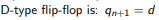
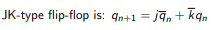
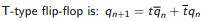

## Digital-electronics-1

https://github.com/Fabulec/Digital-electronics-1

# Lab 7: Latches and Flip-flops:

# 1.Preparation Task:
## Characteristic equations and completed tables for D, JK, T flip-flops:
| D   | Qn  | Q(n+1) | Comments |
| :-: | :-: | :-:    | :--      |
| 0   | 0   |     0   |   No change       |
| 0   | 1   |      0  |    Invert (Toggle)        |
| 1   |  0   |     1   |   Invert (Toggle)        |
| 1   |  1   |      1  |   No change       |



   | J | K | Qn | Q(n+1) | Comments |
   | :-: | :-: | :-: | :-: | :-- |
   | 0 | 0 | 0 | 0 | No change |
   | 0 | 0 | 1 | 1 | No change |
   | 0 | 1 | 0 |0   |    Reset |
   | 0 | 1 | 1 | 0  | Reset    |
   | 1 | 0 | 0 | 1 |        Set   |
   | 1 | 0 | 1 | 1|      Set    |
   | 1 | 1 | 0 | 1|      Toggle    |
   | 1 | 1 | 1 |  0|       Toggle   |


  
 | T | Qn | Q(n+1) | Comments |
   | :-: | :-: | :-: | :--      |
   | 0   |  0  |   0  |   No change       |
   | 0   |  1  |    1 |  No change         |
   | 1   |   0  |    1 |    Invert (Toggle)    |
   | 1   |    1 |     0|   Invert (Toggle)       |



# 2.D latch:
## VHDL code listing of the process ```p_d_latch```:

```vhdl
entity d_latch1 is
    Port (
            en    : in STD_LOGIC;
            arst  : in STD_LOGIC;
            d     : in STD_LOGIC;
            q     : out STD_LOGIC;
            q_bar : out STD_LOGIC);
end d_latch1;

architecture Behavioral of d_latch1 is

begin
------------------------------------------------------------------------
-- p_alarm:
-- A combinational process of alarm clock.
------------------------------------------------------------------------
p_d_latch : process (d, arst, en)

begin
    if (arst = '1' ) then
        q      <= '0';
        q_bar  <= '1';
        
   elsif (en = '1') then
         q       <= d;
        q_bar    <= not d;
    
    end if ;
    
end process p_d_latch;


end Behavioral;

```

## Listing of VHDL reset and stimulus processes from the testbench ```tb_d_latch```:

```vhdl

```

## Screenshot with simulated time waveforms:


# 3. Flip-flops:

## VHDL code listing of the processes ```p_d_ff_arst```, ```p_d_ff_rst```, ```p_jk_ff_rst```, ```p_t_ff_rst```:
### ```p_d_ff_arst```:
```vhdl
entity tb_d_ff_arst is
--  Port ( );
end tb_d_ff_arst;

architecture Behavioral of tb_d_ff_arst is

signal s_en         :std_logic; 
signal s_arst       :std_logic; 
signal s_d          :std_logic; 
signal s_q          :std_logic; 
signal s_q_bar      :std_logic; 

begin
uut_d_ff_arst: entity work.d_ff_arst
port map(                      
                               
    clk      => s_en ,          
    arst    => s_arst ,        
    d       => s_d,            
    q       => s_q ,           
    q_bar   => s_q_bar         
                               
        );                     
                               
end Behavioral;

```
### VHDL code listing of the process ```p_d_ff_rst```

```vhdl

```

### VHDL code listing of the process ```p_jk_ff_rst```
```vhdl
entity jk_ff_rst is
Port (                            
           clk    : in STD_LOGIC; 
           rst  : in STD_LOGIC;  
           j     : in STD_LOGIC;
           k     : in STD_LOGIC; 
           q     : out STD_LOGIC; 
           q_bar : out STD_LOGIC);
          
          
end jk_ff_rst;

architecture Behavioral of jk_ff_rst is
signal s_q : std_logic;
begin

p_d_latch : process (clk)

begin
if rising_edge(clk) then
    if(rst = '1') then
        s_q <= '0';
    else 
        if (j = '0' and k = '0' ) then 
                s_q <= s_q;
                
        elsif (j = '0' and k = '1' ) then
                s_q <= '0' ;
   
        elsif (j = '1' and k = '0' ) then
                s_q <= '1' ;
   
        elsif (j = '1' and k = '1' ) then
                s_q <= not s_q ;
   
   
   
        end if;
        
    end if;
    
 end if;

    
end process p_d_latch;

q       <= s_q;
q_bar   <= not s_q;

end Behavioral;
```
### VHDL code listing of the process ```p_t_ff_rst```
```vhdl

```
## Listing of VHDL clock, reset and stimulus processes from the testbench files:
 
```vhdl

```

## Screenshot, with simulated time waveforms:


# 4. Shift register:

## Image of the shift register schematic:

Obrážťečičičoučik :)

