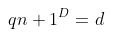
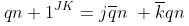
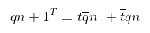
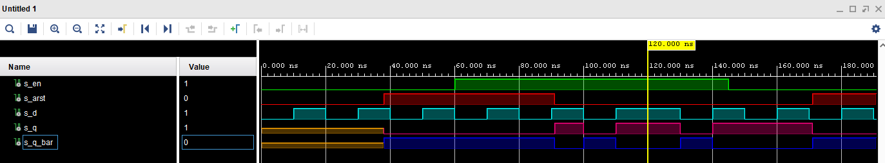
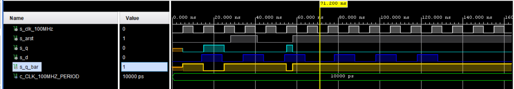
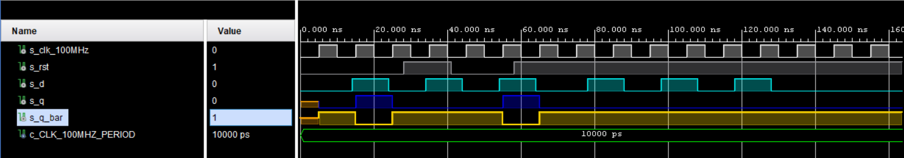
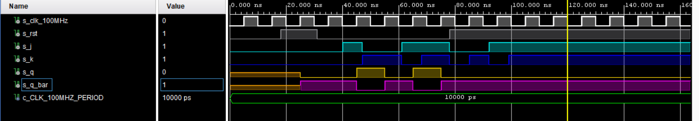
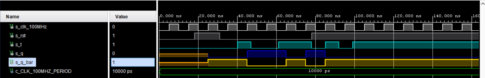
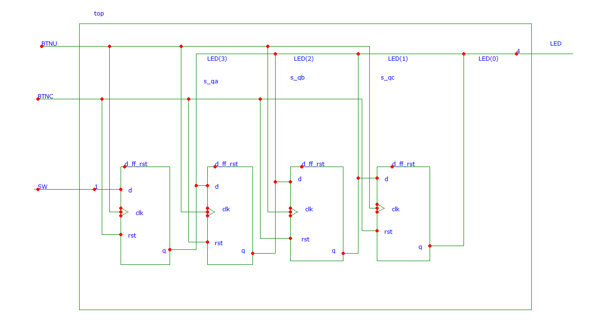

## Digital-electronics-1

https://github.com/Fabulec/Digital-electronics-1

# Lab 7: Latches and Flip-flops:

# 1.Preparation Task:
## Characteristic equations and completed tables for D, JK, T flip-flops:

### Equation "D":
# 
| D   | Qn  | Q(n+1) | Comments |
| :-: | :-: | :-:    | :--      |
| 0   | 0   |     0   |   No change       |
| 0   | 1   |      0  |    Invert (Toggle)        |
| 1   |  0   |     1   |   Invert (Toggle)        |
| 1   |  1   |      1  |   No change       |

### Equation "JK":
# 
   | J | K | Qn | Q(n+1) | Comments |
   | :-: | :-: | :-: | :-: | :-- |
   | 0 | 0 | 0 | 0 | No change |
   | 0 | 0 | 1 | 1 | No change |
   | 0 | 1 | 0 |0   |    Reset |
   | 0 | 1 | 1 | 0  | Reset    |
   | 1 | 0 | 0 | 1 |        Set   |
   | 1 | 0 | 1 | 1|      Set    |
   | 1 | 1 | 0 | 1|      Toggle    |
   | 1 | 1 | 1 |  0|       Toggle   |

### Equation "T":
# 
  
 | T | Qn | Q(n+1) | Comments |
   | :-: | :-: | :-: | :--      |
   | 0   |  0  |   0  |   No change       |
   | 0   |  1  |    1 |  No change         |
   | 1   |   0  |    1 |    Invert (Toggle)    |
   | 1   |    1 |     0|   Invert (Toggle)       |


# 2.D latch:
## VHDL code listing of the process ```p_d_latch```:

```vhdl
entity d_latch1 is
    Port (
            en    : in STD_LOGIC;
            arst  : in STD_LOGIC;
            d     : in STD_LOGIC;
            q     : out STD_LOGIC;
            q_bar : out STD_LOGIC);
end d_latch1;

architecture Behavioral of d_latch1 is

begin
------------------------------------------------------------------------
-- p_alarm:
-- A combinational process of alarm clock.
------------------------------------------------------------------------
p_d_latch : process (d, arst, en)

begin
    if (arst = '1' ) then
        q      <= '0';
        q_bar  <= '1';
        
   elsif (en = '1') then
         q       <= d;
        q_bar    <= not d;
    
    end if ;
    
end process p_d_latch;


end Behavioral;

```


## Listing of VHDL reset and stimulus processes from the testbench ```tb_d_latch```:

```vhdl
--------------------------------------------------------------------
-- Reset generation process
--------------------------------------------------------------------
 p_reset_gen : process
 begin
	 s_arst <= '0';
	 wait for 38 ns;
	 
	 -- Reset activated
	 s_arst <= '1';
	 wait for 53 ns;

	 --Reset deactivated
	 s_arst <= '0';
	
	 wait for 80 ns;
	 s_arst <= '1';

	 wait;
 end process p_reset_gen;

--------------------------------------------------------------------
-- Data generation process
--------------------------------------------------------------------
p_stimulus : process
begin
	report "Stimulus process started" severity note;
	
	s_d  <= '0';
	s_en <= '0';
	
	--d sekv
	wait for 10 ns;
	s_d  <= '1';
	wait for 10 ns;
	s_d  <= '0';
	wait for 10 ns;
	s_d  <= '1';
	wait for 10 ns;
	s_d  <= '0';
	wait for 5 ns;
	
	assert ((s_arst = '1') and (s_en = '0') and (s_q = '0') and (s_q_bar = '1'))
	report "Test failed for reset high, en low when s_d = '0'" severity error;
	
	wait for 5 ns;
	s_d  <= '1';
	wait for 5 ns;
	
	assert ((s_arst = '1') and (s_en = '0') and (s_q = '0') and (s_q_bar = '1'))
	report "Test failed for reset high, en low when s_d = '1'" severity error;
	
	wait for 5 ns;
	s_d  <= '0';
	--/d sekv
	
	s_en <= '1';
	
	--d sekv
	wait for 10 ns;
	s_d  <= '1';
	wait for 5 ns;
	
	assert ((s_arst = '1') and (s_en = '1') and (s_q = '0') and (s_q_bar = '1'))
	report "Test failed for reset high, en high when s_d = '1'" severity error;
	
	wait for 5 ns;
	s_d  <= '0';
	wait for 5 ns;
	
	assert ((s_arst = '1') and (s_en = '1') and (s_q = '0') and (s_q_bar = '1'))
	report "Test failed for reset high, en high when s_d = '0'" severity error;          
	
	wait for 5 ns;
	s_d  <= '1';
	wait for 10 ns;
	s_d  <= '0';
	wait for 10 ns;
	s_d  <= '1';
	wait for 5 ns;
	
	assert ((s_arst = '0') and (s_en = '1') and (s_q = '1') and (s_q_bar = '0'))
	report "Test failed for reset low, en high when s_d = '1'" severity error;
	
	wait for 15 ns;
	s_d  <= '0';
	wait for 5 ns;
	
	assert ((s_arst = '0') and (s_en = '1') and (s_q = '0') and (s_q_bar = '1'))
	report "Test failed for reset low, en high when s_d = '0'" severity error;
	
	--/d sekv
	
	--d sekv
	wait for 5 ns;
	s_d  <= '1';
	wait for 5 ns;
	s_en <= '0';
	wait for 5 ns;
	s_d  <= '0';

	wait for 10 ns;
	s_d  <= '1';
	wait for 10 ns;
	s_d  <= '0';
	wait for 10 ns;
	s_d  <= '1';
	wait for 10 ns;
	s_d  <= '0';
	--/d sekv
	
	

	report "Stimulus process finished" severity note;
	wait;
end process p_stimulus;
```


## Screenshot with simulated time waveforms:




# 3. Flip-flops:

## VHDL code listing of the processes ```p_d_ff_arst```, ```p_d_ff_rst```, ```p_jk_ff_rst```, ```p_t_ff_rst```:


### VHDL code listing of the process ```p_d_ff_arst```:
```vhdl
entity tb_d_ff_arst is
--  Port ( );
end tb_d_ff_arst;

Architecture Behavioral of tb_d_ff_arst is

signal s_en         :std_logic; 
signal s_arst       :std_logic; 
signal s_d          :std_logic; 
signal s_q          :std_logic; 
signal s_q_bar      :std_logic; 

begin
uut_d_ff_arst: entity work.d_ff_arst
port map(                      
                               
    clk      => s_en ,          
    arst    => s_arst ,        
    d       => s_d,            
    q       => s_q ,           
    q_bar   => s_q_bar         
                               
        );                     
                               
end Behavioral;

```


### VHDL code listing of the process ```p_d_ff_rst```

```vhdl
library IEEE;
use IEEE.STD_LOGIC_1164.ALL;

entity d_ff_rst is
    Port ( 
        clk   : in  STD_LOGIC;
        rst   : in  STD_LOGIC;
        d     : in  STD_LOGIC;
        q     : out STD_LOGIC;
        q_bar : out STD_LOGIC
    );
end d_ff_rst;

architecture Behavioral of d_ff_rst is

begin

    p_d_ff_rst : process (clk)
    begin
        if rising_edge(clk) then
            if (rst = '1') then
                q <= '0';
                q_bar <= '1';
            else
                q <= d;
                q_bar <= not d;
            end if;
        end if;
    end process p_d_ff_rst;

end Behavioral;

```


### VHDL code listing of the process ```p_jk_ff_rst```
```vhdl
entity jk_ff_rst is
Port (                            
           clk    : in STD_LOGIC; 
           rst  : in STD_LOGIC;  
           j     : in STD_LOGIC;
           k     : in STD_LOGIC; 
           q     : out STD_LOGIC; 
           q_bar : out STD_LOGIC);
          
          
end jk_ff_rst;

architecture Behavioral of jk_ff_rst is
signal s_q : std_logic;
begin

p_d_latch : process (clk)

begin
if rising_edge(clk) then
    if(rst = '1') then
        s_q <= '0';
    else 
        if (j = '0' and k = '0' ) then 
                s_q <= s_q;
                
        elsif (j = '0' and k = '1' ) then
                s_q <= '0' ;
   
        elsif (j = '1' and k = '0' ) then
                s_q <= '1' ;
   
        elsif (j = '1' and k = '1' ) then
                s_q <= not s_q ;
   
   
   
        end if;
        
    end if;
    
 end if;

    
end process p_d_latch;

q       <= s_q;
q_bar   <= not s_q;

end Behavioral;
```


### VHDL code listing of the process ```p_t_ff_rst```
```vhdl
library IEEE;
use IEEE.STD_LOGIC_1164.ALL;


entity t_ff_rst is
    Port ( 
        clk   : in  STD_LOGIC;
        rst   : in  STD_LOGIC;
        t     : in  STD_LOGIC;
        q     : out STD_LOGIC;
        q_bar : out STD_LOGIC
    );
end t_ff_rst;

architecture Behavioral of t_ff_rst is
    signal s_q : std_logic;
begin
    
p_t_ff_rst : process (clk)
begin
    if rising_edge(clk) then
        if (rst = '1') then
            s_q <= '0';
        elsif (t = '1') then
            s_q <= not s_q;
        end if;
    end if;

end process p_t_ff_rst;

q <= s_q;
q_bar <= not s_q;
    
    
end Behavioral;
```


## Listing of VHDL clock, reset and stimulus processes from the testbench files:
### tb_d_ff_arst
```vhdl
library IEEE;
use IEEE.STD_LOGIC_1164.ALL;


entity tb_d_ff_arst is

end tb_d_ff_arst;

architecture Behavioral of tb_d_ff_arst is
    
    constant c_CLK_100MHZ_PERIOD : time := 10 ns;
    --Local signals
    signal s_clk_100MHz : std_logic;

    signal s_arst       : std_logic;
    signal s_d          : std_logic;
    signal s_q          : std_logic;
    signal s_q_bar      : std_logic;

begin

    uut_d_ff_arst : entity work.d_ff_arst
        port map(
            clk     => s_clk_100MHz,
            arst    => s_arst,
            d       => s_d,
            q       => s_q,
            q_bar   => s_q_bar
        );

    --------------------------------------------------------------------
    -- Clock generation process
    --------------------------------------------------------------------
    p_clk_gen : process
    begin
        while now < 40 ms loop        
            s_clk_100MHz <= '0';
            wait for c_CLK_100MHZ_PERIOD / 2;
            s_clk_100MHz <= '1';
            wait for c_CLK_100MHZ_PERIOD / 2;
        end loop;
        wait;
    end process p_clk_gen;
    
    --------------------------------------------------------------------
    -- Reset generation process
    --------------------------------------------------------------------

     p_reset_gen : process
        begin
            s_arst <= '0';
            wait for 28 ns;
            
            -- Reset activated
            s_arst <= '1';
            wait for 13 ns;
    
            --Reset deactivated
            s_arst <= '0';
            
            wait for 17 ns;
            
            s_arst <= '1';
            wait for 33 ns;
            
            wait for 660 ns;
            s_arst <= '1';
    
            wait;
     end process p_reset_gen;

    --------------------------------------------------------------------
    -- Data generation process
    --------------------------------------------------------------------
    p_stimulus : process
    begin
        report "Stimulus process started" severity note;
        
        s_d  <= '0';
        
        --d sekv
        wait for 14 ns;
        s_d  <= '1';
        wait for 2 ns;
        
        assert ((s_arst = '0') and (s_q = '1') and (s_q_bar = '0'))
        report "Test failed for reset low, after clk rising when s_d = '1'" severity error;
        
        wait for 8 ns;
        s_d  <= '0';
        wait for 6 ns;
        
        --assert()
        --report "";
        
        wait for 4 ns;
        s_d  <= '1';
        wait for 10 ns;
        s_d  <= '0';
        wait for 10 ns;
        s_d  <= '1';
        wait for 5 ns;
        
        -- verify that reset is truly asynchronous
        assert ((s_arst = '1') and (s_q = '0') and (s_q_bar = '1'))
        report "Test failed for reset high, before clk rising when s_d = '1'" severity error;
        
        wait for 5 ns;
        s_d  <= '0';
        --/d sekv
        
        --d sekv
        wait for 14 ns;
        s_d  <= '1';
        wait for 10 ns;
        s_d  <= '0';
        wait for 10 ns;
        s_d  <= '1';
        wait for 10 ns;
        s_d  <= '0';
        wait for 10 ns;
        s_d  <= '1';
        wait for 10 ns;
        s_d  <= '0';
        --/d sekv
        
       
        report "Stimulus process finished" severity note;
        wait;
    end process p_stimulus;


end Behavioral;
```
### tb_d_ff_rst
```vhdl
library IEEE;
use IEEE.STD_LOGIC_1164.ALL;


entity tb_d_ff_rst is

end tb_d_ff_rst;

architecture Behavioral of tb_d_ff_rst is

    constant c_CLK_100MHZ_PERIOD : time    := 10 ns;
    --Local signals
    signal s_clk_100MHz : std_logic;

    signal s_rst        : std_logic;
    signal s_d          : std_logic;
    signal s_q          : std_logic;
    signal s_q_bar      : std_logic;

begin

    uut_d_ff_rst : entity work.d_ff_rst
        port map(
            clk     => s_clk_100MHz,
            rst     => s_rst,
            d       => s_d,
            q       => s_q,
            q_bar   => s_q_bar
        );

    --------------------------------------------------------------------
    -- Clock generation process
    --------------------------------------------------------------------
    p_clk_gen : process
    begin
        while now < 40 ms loop        
            s_clk_100MHz <= '0';
            wait for c_CLK_100MHZ_PERIOD / 2;
            s_clk_100MHz <= '1';
            wait for c_CLK_100MHZ_PERIOD / 2;
        end loop;
        wait;
    end process p_clk_gen;
    
    --------------------------------------------------------------------
    -- Reset generation process
    --------------------------------------------------------------------

     p_reset_gen : process
        begin
            s_rst <= '0';
            wait for 28 ns;
            
            -- Reset activated
            s_rst <= '1';
            wait for 13 ns;
    
            --Reset deactivated
            s_rst <= '0';
            
            wait for 17 ns;
            
            s_rst <= '1';
            wait for 33 ns;
            
            wait for 660 ns;
            s_rst <= '1';
    
            wait;
     end process p_reset_gen;

    --------------------------------------------------------------------
    -- Data generation process
    --------------------------------------------------------------------
    p_stimulus : process
    begin
        report "Stimulus process started" severity note;
        
        s_d  <= '0';
        
        --d sekv
        wait for 14 ns;
        s_d  <= '1';
        wait for 2 ns;
        
        assert ((s_rst = '0') and (s_q = '1') and (s_q_bar = '0'))
        report "Test failed for reset low, after clk rising when s_d = '1'" severity error;
        
        wait for 8 ns;
        s_d  <= '0';
        wait for 6 ns;
        
        --assert()
        --report "";
        
        wait for 4 ns;
        s_d  <= '1';
        wait for 10 ns;
        s_d  <= '0';
        wait for 10 ns;
        s_d  <= '1';
        wait for 5 ns;
        
        -- verify that reset is truly synchronous
        assert ((s_rst = '1') and (s_q = '1') and (s_q_bar = '0'))
        report "Test failed for reset high, before clk rising when s_d = '1'" severity error;
        
        wait for 5 ns;
        s_d  <= '0';
        --/d sekv
        
        --d sekv
        wait for 14 ns;
        s_d  <= '1';
        wait for 10 ns;
        s_d  <= '0';
        wait for 10 ns;
        s_d  <= '1';
        wait for 10 ns;
        s_d  <= '0';
        wait for 10 ns;
        s_d  <= '1';
        wait for 10 ns;
        s_d  <= '0';
        --/d sekv
        
       
        report "Stimulus process finished" severity note;
        wait;
    end process p_stimulus;


end Behavioral;
```
### tb_jk_ff_rst
```vhdl
library IEEE;
use IEEE.STD_LOGIC_1164.ALL;


entity tb_jk_ff_rst is

end tb_jk_ff_rst;

architecture Behavioral of tb_jk_ff_rst is

    constant c_CLK_100MHZ_PERIOD : time    := 10 ns;
    --Local signals
    signal s_clk_100MHz    : std_logic;

    signal s_rst   : std_logic;
    signal s_j     : std_logic;
    signal s_k     : std_logic;
    signal s_q     : std_logic;
    signal s_q_bar : std_logic;

begin

uut_jk_ff_rst : entity work.jk_ff_rst
        port map(
            clk     => s_clk_100MHz,
            rst     => s_rst,
            j       => s_j,
            k       => s_k,
            q       => s_q,
            q_bar   => s_q_bar
        );
    
    --------------------------------------------------------------------
    -- Clock generation process
    --------------------------------------------------------------------
    p_clk_gen : process
    begin
        while now < 40 ms loop        
            s_clk_100MHz <= '0';
            wait for c_CLK_100MHZ_PERIOD / 2;
            s_clk_100MHz <= '1';
            wait for c_CLK_100MHZ_PERIOD / 2;
        end loop;
        wait;
    end process p_clk_gen;
    
    --------------------------------------------------------------------
    -- Reset generation process
    --------------------------------------------------------------------

     p_reset_gen : process
        begin
            s_rst <= '0';
            wait for 18 ns;
            
            -- Reset activated
            s_rst <= '1';
            wait for 13 ns;
    
            --Reset deactivated
            s_rst <= '0';
            
            wait for 47 ns;
            
            s_rst <= '1';
            wait for 33 ns;
            
            wait for 660 ns;
            s_rst <= '1';
    
            wait;
     end process p_reset_gen;

    --------------------------------------------------------------------
    -- Data generation process
    --------------------------------------------------------------------
    p_stimulus : process
    begin
        report "Stimulus process started" severity note;
        
        s_j  <= '0';
        s_k  <= '0';
        
        --d sekv
        wait for 38 ns;
        
        assert ((s_rst = '0') and (s_j = '0') and (s_k = '0') and (s_q = '0') and (s_q_bar = '1'))
        report "Test 'no change' failed for reset low, after clk rising when s_j = '0' and s_k = '0'" severity error;
        
        wait for 2 ns;
        s_j  <= '1';
        s_k  <= '0';
        wait for 6 ns;
        
        assert ((s_rst = '0') and (s_j = '1') and (s_k = '0') and (s_q = '1') and (s_q_bar = '0'))
        report "Test 'set' failed for reset low, after clk rising when s_j = '1' and s_k = '0'" severity error;
        
        wait for 1 ns;
        s_j  <= '0';
        s_k  <= '1';
        wait for 13 ns;
        
        assert ((s_rst = '0') and (s_j = '0') and (s_k = '1') and (s_q = '0') and (s_q_bar = '1'))
        report "Test 'reset' failed for reset low, after clk rising when s_j = '0' and s_k = '1'" severity error;
        
        wait for 1 ns;
        s_j  <= '1';
        s_k  <= '0';
        wait for 7 ns;
        s_j  <= '1';
        s_k  <= '1';
        
        wait for 8 ns;
        
        assert ((s_rst = '0') and (s_j = '1') and (s_k = '1') and (s_q = '0') and (s_q_bar = '1'))
        report "Test 'toggle' failed for reset low, after clk rising when s_j = '1' and s_k = '1'" severity error;
        
        wait for 2 ns;
        s_j  <= '0';
        s_k  <= '0';
        wait for 7 ns;
        s_j  <= '0';
        s_k  <= '1';
        wait for 7 ns;
        s_j  <= '1';
        s_k  <= '0';
        wait for 7 ns;
        s_j  <= '1';
        s_k  <= '1';
        
        --assert()
        --report "";
        
        
       
        
        
    
        report "Stimulus process finished" severity note;
        wait;
    end process p_stimulus;

end Behavioral;
```
### tb_t_ff_rst
```vhdl
library IEEE;
use IEEE.STD_LOGIC_1164.ALL;


entity tb_t_ff_rst is

end tb_t_ff_rst;

architecture Behavioral of tb_t_ff_rst is

    constant c_CLK_100MHZ_PERIOD : time    := 10 ns;
    --Local signals
    signal s_clk_100MHz    : std_logic;

    signal s_rst   : std_logic;
    signal s_t     : std_logic;
    signal s_q     : std_logic;
    signal s_q_bar : std_logic;

begin

uut_t_ff_rst : entity work.t_ff_rst
        port map(
            clk     => s_clk_100MHz,
            rst     => s_rst,
            t       => s_t,
            q       => s_q,
            q_bar   => s_q_bar
        );
    
    --------------------------------------------------------------------
    -- Clock generation process
    --------------------------------------------------------------------
    p_clk_gen : process
    begin
        while now < 40 ms loop        
            s_clk_100MHz <= '0';
            wait for c_CLK_100MHZ_PERIOD / 2;
            s_clk_100MHz <= '1';
            wait for c_CLK_100MHZ_PERIOD / 2;
        end loop;
        wait;
    end process p_clk_gen;
    
    --------------------------------------------------------------------
    -- Reset generation process
    --------------------------------------------------------------------

     p_reset_gen : process
        begin
            s_rst <= '0';
            wait for 18 ns;
            
            -- Reset activated
            s_rst <= '1';
            wait for 13 ns;
    
            --Reset deactivated
            s_rst <= '0';
            
            wait for 47 ns;
            
            s_rst <= '1';
            wait for 33 ns;
            
            wait for 660 ns;
            s_rst <= '1';
    
            wait;
     end process p_reset_gen;

    --------------------------------------------------------------------
    -- Data generation process
    --------------------------------------------------------------------
    p_stimulus : process
    begin
        report "Stimulus process started" severity note;
        
        s_t  <= '0';
        
        --d sekv
        wait for 38 ns;
        
        assert ((s_rst = '0') and (s_t = '0') and (s_q = '0') and (s_q_bar = '1'))
        report "Test 'no change' failed for reset low, after clk rising when s_t = '0'" severity error;
        
        wait for 2 ns;
        s_t  <= '1';
        wait for 6 ns;
        
        assert ((s_rst = '0') and (s_t = '1') and (s_q = '1') and (s_q_bar = '0'))
        report "Test 'toggle' failed for reset low, after clk rising when s_t = '1'" severity error;
        
        wait for 1 ns;
        s_t  <= '0';
        wait for 13 ns;
        
        assert ((s_rst = '0') and (s_t = '0') and (s_q = '1') and (s_q_bar = '0'))
        report "Test 'no change' failed for reset low, after clk rising when s_t = '0'" severity error;
        
        wait for 1 ns;
        s_t  <= '1';
        wait for 5 ns;
        
        assert ((s_rst = '0') and (s_t = '1') and (s_q = '0') and (s_q_bar = '1'))
        report "Test 'toggle' failed for reset low, after clk rising when s_t = '1'" severity error;
        
        wait for 12 ns;
        s_t  <= '0';
        wait for 7 ns;
        s_t  <= '1';
        wait for 7 ns;
        s_t  <= '0';
        wait for 7 ns;
        s_t  <= '1';
        
        --assert()
        --report "";
        
        
       
        
        
    
        report "Stimulus process finished" severity note;
        wait;
    end process p_stimulus;

end Behavioral;
```


## Screenshot, with simulated time waveforms:

### ``` tb_d_ff_arst ```

### ```tb_d_ff_rst ```

### ```tb_jk_ff_rst  ```

### ```tb_t_ff_rst  ```



# 4. Shift register:

## Image of the shift register schematic:



